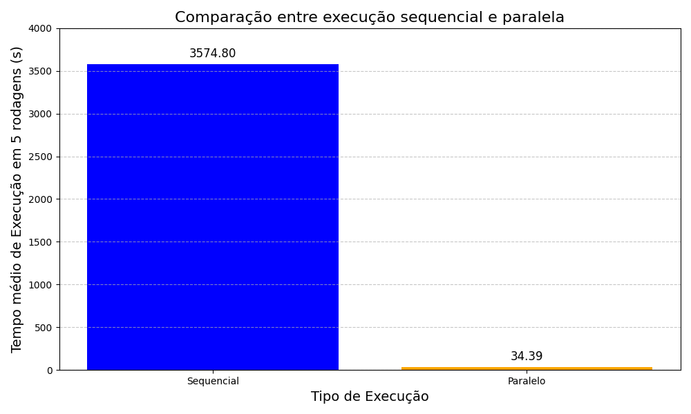
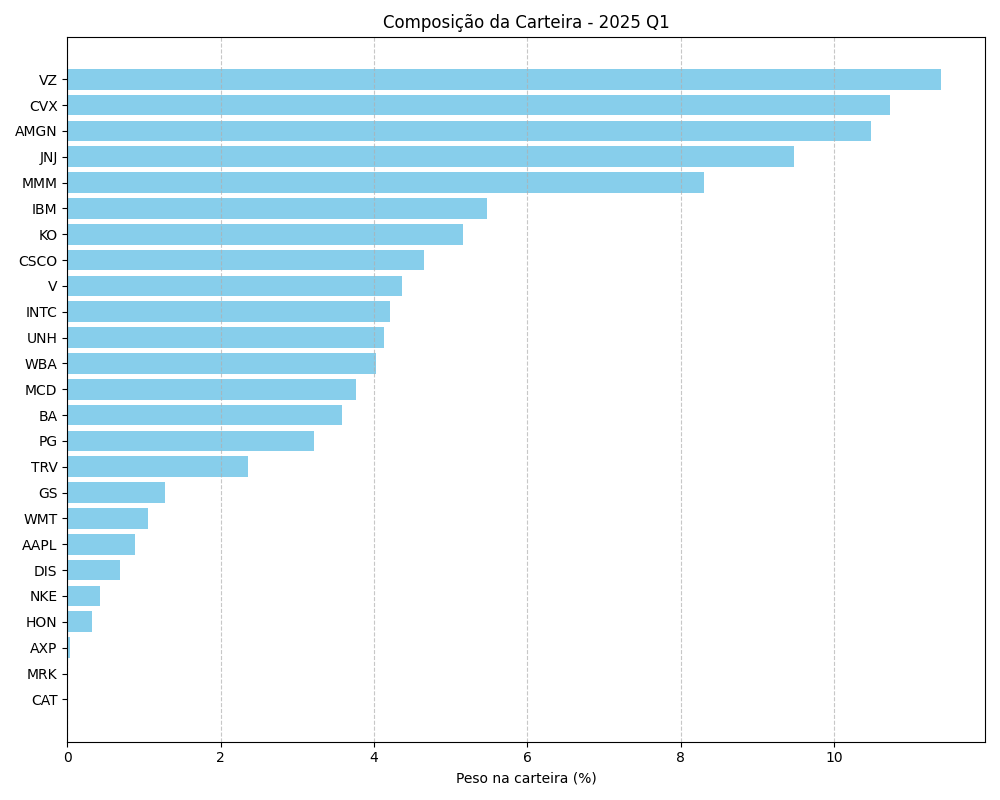

# Otimização de Carteira de Investimentos

Este projeto implementa um otimizador de carteira de investimentos que utiliza dados históricos dos ativos do índice Dow Jones para encontrar a melhor combinação de ativos e seus respectivos pesos, maximizando o Índice de Sharpe.

## Funcionalidades

-   Otimização de carteira com 25 ativos selecionados entre os 30 do Dow Jones
-   Dois modos de otimização:
    -   Sequencial: Processamento em série, ideal para testes e análises menores
    -   Paralelo: Processamento distribuído, otimizado para análises mais extensas
-   Cálculo automático do Índice de Sharpe
-   Geração de gráficos comparativos de performance
-   Interface via linha de comando

## Requisitos

-   Python 3.8+
-   UV (gerenciador de pacotes Python)
-   Conexão com internet para acesso à API de dados

## Instalação

1. Primeiramente instale [UV](https://docs.astral.sh/uv/getting-started/installation/), no seu computador

2. Clone este repositório:

```bash
git clone [URL_DO_REPOSITÓRIO]
cd [NOME_DO_DIRETÓRIO]
```

3. Execute o programa:

```bash
uv run main.py
```

## Como Usar

1. Ao executar o programa, você será solicitado a escolher o modo de otimização:

    - `s` para otimização sequencial
    - `p` para otimização paralela

2. O programa irá:
    - Buscar dados históricos dos ativos
    - Realizar a otimização da carteira
    - Exibir os resultados com:
        - Melhor Índice de Sharpe encontrado
        - Tickers selecionados
        - Pesos da carteira otimizada
        - Tempo total de execução

## Resultados

### Comparação de Performance

O gráfico abaixo compara o tempo de execução para analisar 1000 alocações diferentes para uma única combinação de 25 dos 30 ativos do índice Dow Jones. Os dados são referentes ao período de 01/08/2024 a 31/12/2024.



### Teste no Q1 2025

Ao testar 10000 alocações diferentes para 25 ativos, o melhor Sharpe obtido foi `4.0258`:



## Estrutura do Projeto

-   `main.py`: Arquivo principal com a interface do usuário
-   `sequential.py`: Implementação da otimização sequencial
-   `paralel.py`: Implementação da otimização paralela
-   `graficos/`: Diretório contendo os gráficos gerados
-   `scripts/`: Scripts auxiliares

### Extra:

A API que traz os dados pode ser vista [aqui](https://github.com/marchettomarcelo/yahoo-dow-data-py).
